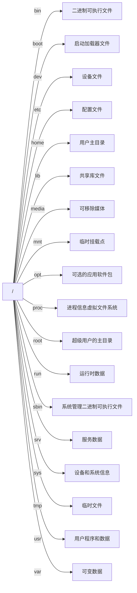

# Linux 核心速查指南

## 文件系统结构



| 目录     | 描述                                                                               |
| -------- | ---------------------------------------------------------------------------------- |
| `/bin`   | 二进制可执行文件（命令），通常没有子目录                                           |
| `/boot`  | 包含 GRUB 启动加载器配置和内核文件                                                 |
| `/dev`   | 设备文件（如 `sda` 硬盘、`tty` 终端）                                              |
| `/etc`   | 系统配置文件（如 `apache2` 服务器配置、`ssh` 配置）                                |
| `/home`  | 用户主目录，按用户名创建子目录                                                     |
| `/lib`   | 共享库文件（如 `systemd` 系统服务库）                                              |
| `/media` | 自动挂载可移动媒体设备（如 USB）                                                   |
| `/mnt`   | 手动挂载临时文件系统的挂载点                                                       |
| `/opt`   | 第三方应用软件安装目录，按软件名创建子目录                                         |
| `/proc`  | 虚拟文件系统，提供内核和进程状态信息                                               |
| `/root`  | root 用户专属主目录                                                                |
| `/sbin`  | 系统管理命令，通常没有子目录                                                       |
| `/srv`   | 服务数据目录，结构根据服务器应用需求变化                                           |
| `/sys`   | 虚拟文件系统，提供设备和驱动配置接口                                               |
| `/tmp`   | 临时文件，系统重启自动清空                                                         |
| `/usr`   | 用户程序资源，包含 `bin`（用户命令）、`lib`（用户库）、`share`（共享数据）等子目录 |
| `/var`   | 可变数据，包含 `log`（日志）、`mail`（邮件）、`www`（网页）等子目录                |

## 高频命令速查

### 文件操作

```bash
ls -alh           # 详细列表（含隐藏文件）
cp -r dir1 dir2   # 递归复制目录
mv old new        # 移动/重命名
rm -rf dir        # 强制递归删除（慎用！）
find / -name "*.log"  # 全局文件搜索
```

### 文本处理

```bash
cat file | grep "pattern"    # 文本过滤
head -n 20 file              # 显示前20行
tail -f /var/log/syslog      # 实时追踪日志
vim file                     # 编辑文件（:wq保存退出）
```

### 系统管理

```bash
sudo !!            # 用sudo执行上条命令
ps aux | grep nginx# 进程搜索
kill -9 PID        # 强制终止进程
df -h              # 磁盘空间查看
free -m            # 内存使用情况
```

### 网络相关

```bash
curl -I example.com  # 查看HTTP头
netstat -tulpn       # 查看开放端口
ssh user@host -p22   # SSH连接
scp file user@host:/path  # 安全传输
```

### 包管理（Debian系）

```bash
apt update          # 更新源列表
apt install package # 安装软件
apt remove --purge package  # 彻底卸载
dpkg -l | grep nginx# 查询已安装包
```

## 权限管理速记

```bash
chmod 755 script.sh  # 设置权限：rwxr-xr-x
chown user:group file # 修改所有者
umask 022            # 新建文件默认权限
```

## 系统服务管理

```bash
systemctl start nginx    # 启动服务
systemctl enable nginx   # 设置开机启动
journalctl -u nginx -f   # 查看服务日志
```

## 快捷键备忘

| 组合键 | 功能               |
| ------ | ------------------ |
| Ctrl+C | 终止当前命令       |
| Ctrl+Z | 挂起进程（fg恢复） |
| Ctrl+D | EOF/退出终端       |
| Tab    | 命令补全           |
| ↑/↓    | 历史命令导航       |

## 应急技巧

```bash
# 忘记root密码
1. 重启系统 -> GRUB界面按e
2. 在linux行尾添加 init=/bin/bash
3. Ctrl+X启动 -> mount -o remount,rw /
4. passwd 修改密码

# 磁盘修复模式
fsck /dev/sda1  # 文件系统检查
```

> 提示：使用`man <命令>`查看详细手册，`tldr <命令>`获取简化版帮助
